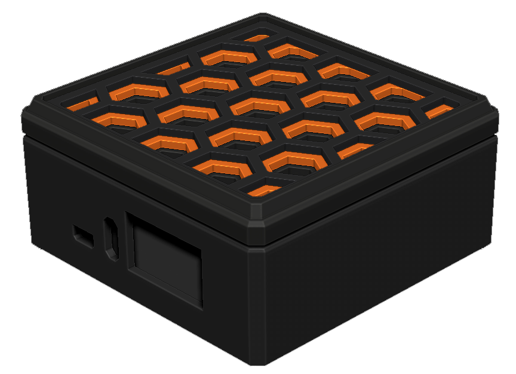

# RETRO OPI
3D Printed case and custom armbian image script.

## PRE-MADE IMAGE REQUIREMENTS:
- Orange Pi Zero 3 SBC
- 8GB+ Micro SD Card

## PRE-MADE IMAGE INSTRUCTIONS:
1. Download premade image here: ` `
2. Use `rufus` or `balenaEtcher` to write to a an SD
3. Insert into Orange Pi Zero 3 and power

## BUILD REQUIREMENTS:
- Orange Pi SBC
- PC running your favourite linux
- Sufficient CPU/RAM/DISK to compile armbian

## BUILD INSTRUCTIONS:
1.  `git clone https://github.com/Maker-Kit-Laboratories/Retro_OPi.git`
2.  `cd Retro_Opi`
3.  `./create-retro-opi-image.sh`

## ISSUES:
- Tested on:
    - Orange Pi Zero 3
    - Orange Pi Zero 2W