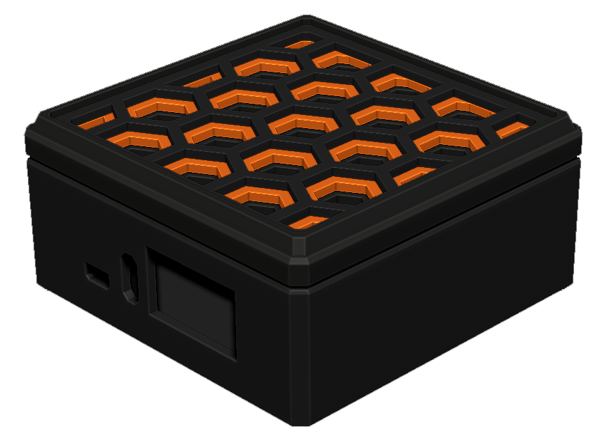
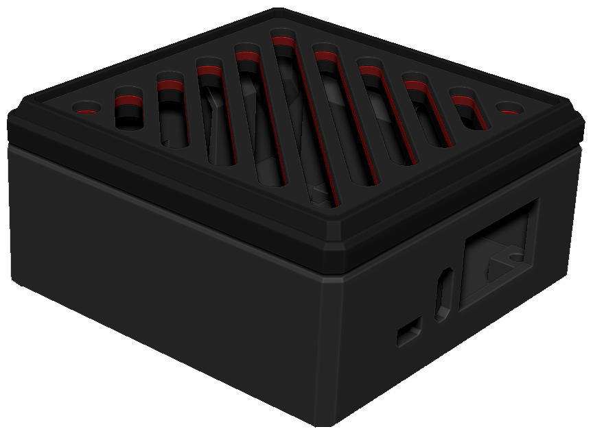

# RETRO-OPI CONSOLE

### DESCRIPTION:
Custom armbian build script intregrating Retro Pie and open source ROMs.

### PRE-BUILT IMAGE REQUIREMENTS:
- Orange Pi Zero 3 SBC
- 8GB+ Micro SD Card

### PRE-BUILT IMAGE INSTRUCTIONS:
1. Download pre-built image here -> [retro-opi-0.15-armbian-25.08-orangepizero3.img.xz](https://makerkitlab.xyz/data/kit/retroopi/retro-opi-0.15-armbian-25.08-orangepizero3.img.xz)
2. Use `balenaEtcher` or `Raspberry Pi Imager` to write to an SD card.
3. Insert into Orange Pi Zero 3 and power.
4. See Usage below.

### BUILD REQUIREMENTS:
- Orange Pi SBC
- Linux PC

### BUILD INSTRUCTIONS:
1.  `git clone https://github.com/Maker-Kit-Laboratories/RETRO-OPI.git`
2.  `cd RETRO-OPI`
3.  `./create-retro-opi-image.sh`

### USAGE:
- Boot Process:
    - Automatic login to user: `robot`.
    - Boot splash.
    - Network check.
    - Network setup. `Esc` to cancel.
    - Enable file sharing if network check passes.
        - server: `\\retro-opi.local\roms`
        - user: `robot`
        - password: `retroopi`
    - Run Retro Pie. `F4` to exit. Type `emlulationstation` in the console to restart.
- Helpful custom commands:
    - `ropi-set-resolution` : Sets a custom video resolution on boot.
    - `ropi-connect-network` : Setup a network connection and file sharing.
- Credentials:
    - user: `robot`  
    - password: `retroopi`
- Hostname: `retro-opi`
- SSH command: `ssh robot@retro-opi.local`

### NOTES:
- Version 0.15
- Tested on:
    - Orange Pi Zero 3
    - Orange Pi Zero 2W

# SUPPORT:
- If you'd like to support this project, consider buying a kit @ [Maker Kit Laboratories - Printables](https://www.printables.com/@MakerKitLab_2578894)

- Comfirm supported boards and submit any issues you come across. Thanks!
