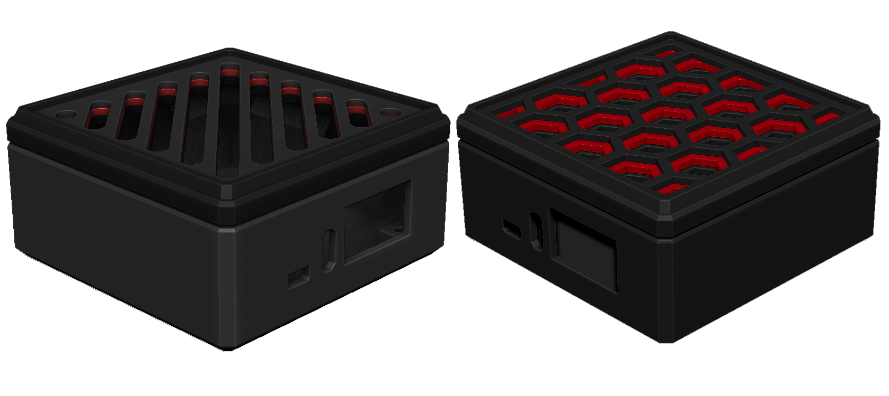

# RETRO-ARM CONSOLE

### DESCRIPTION:
- Custom Armbian build script intregrating Retro Pie and optional retro-brew ROMs.
- Version 0.2.4

### PRE-BUILT IMAGE REQUIREMENTS:
- Tested SBCs:
    - Orange Pi Zero 3
    - Orange Pi Zero 2w
    - Orange Pi 3 LTS
- 8GB+ Micro SD card.
- `INITIAL BOOT ONLY` - Keyboard.

### PRE-BUILT IMAGE INSTRUCTIONS:
1. Download pre-built image here:
    - Orange Pi Zero 3 -> [retro-arm-0.2.3-armbian-25.08-orangepizero3.img.xz](https://makerkitlab.xyz/data/kit/retroarm/retro-arm-0.2.3-armbian-25.08-orangepizero3.img.xz)
    - More coming...
2. Write the image to an SD card using:
    - [balenaEtcher](https://www.balena.io/etcher/) 
    - [Raspberry Pi Imager](https://www.raspberrypi.com/software/)
    - [rufus](https://rufus.ie/)
3. Insert into SBC and power.

### USAGE:
#### Automated Boot Process:
0. Automatic login to user: `robot`.
1. Ascii splash.
2. `INITIAL BOOT ONLY` - Set system password.
3. `INITIAL BOOT ONLY` - Network setup. `Esc` to cancel.
4. Network check. 
5. Enable file sharing if network check passes.
    - server: `\\retro-arm.local\roms`
    - user: `robot`
    - password: `<system password>`
6. `INITIAL BOOT ONLY` - Resolution setup: 1280x720 suggested depending on your SBC's capabilities.
7. `INITIAL BOOT ONLY` - Reboot.
8. Retro Pie starts.
#### Commands:
- Key `F4` : Exit Retro Pie.
- `rarm-play` : Start Retro Pie.
- `rarm-resolution` : Sets a custom video resolution on boot.
- `rarm-connect` : Setup a network connection and file sharing.
- `rarm-password` : Change system password.
- `rarm-retrobrew` : Install retrobew ROMs.
- `rarm-reset` : Reset console. Clear installed ROMs. Clear resolution. Clear network.
#### Credentials:
- user: `robot` / `root`
- password: `<system password>`
#### Hostname: 
- `retro-arm`
#### SSH command: 
- `ssh robot@retro-arm.local`
#### Notes:
- Initial boot takes longer depending on hardware.
- TODO:
    - Include `rarm-*` commands in Retro Pie menu.

# BUILD (OPTIONAL):

### BUILD REQUIREMENTS:
- Armbian supported SBC.
- Linux PC.

### BUILD INSTRUCTIONS:
1. `git clone https://github.com/Maker-Kit-Laboratories/retro-arm.git`
2. `cd retro-arm`
3. `./create-retro-arm-image.sh` Optional arguments: `BOARD=<configname>`
4. Follow instructions and build with desired setup.

## LICENSE:
- CC BY 4.0
- [Armbian](https://www.armbian.com/), [RetroPie](https://retropie.org.uk/), and all optionally included open source [retrobrews](https://retrobrews.github.io/) are under their respective licenses.

# SUPPORT:
- If you'd like to support this project, consider buying a `RETRO-ARMBIAN` kit @ [Maker Kit Laboratories - Printables](https://www.printables.com/@MakerKitLab_2578894)
- Comfirm supported boards and submit any issues you come across. Thanks!